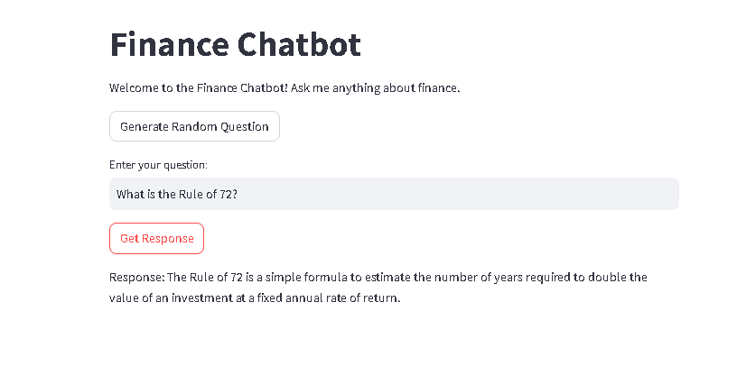
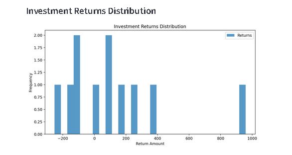

# 🚀 Personal Financial Advisor - Empowering Smart Financial Decisions Through AI and ML Learning

# Finance Chatbot

The Finance Chatbot is an interactive web application designed to answer finance-related questions. It utilizes a collection of pre-defined Q&A pairs, which can be easily updated to reflect the latest financial information.

## Features

- **Random Question Generator**: Displays a random finance question from the dataset.
- **Custom Question Input**: Users can input their own questions and receive tailored responses.
- **External Links in Responses**: Recognizes URLs in responses and provides clickable links for further reading.
- **User-Friendly Interface**: Built with Streamlit, ensuring a smooth and engaging user experience.

## Screenshots

1. **Main Interface**: The primary user interface where users interact with the chatbot.
   

2. **Question Input**: Interface for entering custom finance questions.
   

## Getting Started

Follow these instructions to set up the Finance Chatbot on your local machine for development and testing purposes.

### Prerequisites

- Python 3.x
- Streamlit
- A JSON file containing finance-related Q&A pairs (`config.json`)

Install the necessary Python packages using pip:

pip install streamlit

# Financial News Sentiment Analysis App

This application fetches financial news articles based on a given stock ticker, analyzes the sentiment of these articles, and provides buy or sell recommendations based on the analysis.

## Features

- **Fetch Financial News**: Retrieve the latest financial news articles for any given stock ticker using the News API.
- **Sentiment Analysis**: Analyze the sentiment of each article's title and description to determine the overall sentiment polarity.
- **Dynamic Recommendations**: Provide real-time recommendations (BUY, SELL, or HOLD) based on the average sentiment of the news articles.
- **Data Visualization**: Visualize sentiment trends over time with interactive plots.
- **CSV Download**: Allow users to download the sentiment analysis results as a CSV file for further analysis.
- **User-Friendly Interface**: Streamlined interface built with Streamlit for easy interaction and accessibility.

## Functionalities

1. **Enter API Key and Ticker Symbol**: Users input their News API key and the ticker symbol of the stock they are interested in.
2. **Fetch News**: Upon entering the details and pressing the button, the application fetches the news articles related to the specified ticker.
3. **Sentiment Analysis**: The application analyzes the sentiment of each fetched article to determine its polarity.
4. **Recommendations**: Based on the analysis, the app provides recommendations to BUY, SELL, or HOLD the stock.
5. **Display and Download Data**: The application displays the news articles along with their sentiment scores and provides an option to download this data as a CSV file.
6. **Visual Sentiment Trends**: Interactive graphs show sentiment trends over time, helping users visualize the sentiment changes.

## Screenshots

### User Interface

_Figure 1: Main User Interface showing the input fields for API key and ticker symbol._

### Sentiment Analysis Visualization

_Figure 2: Visualization of sentiment analysis results and recommendation chart._

### Sentiment Analysis overTime Visualization

_Figure 3: Visualization of sentiment analysis results overtime._

# Personal Finance Management App

This application helps users manage their monthly budgets efficiently and provides investment recommendations based on their financial inputs. It also fetches real-time stock data and analyzes investment returns.

## Features

- **Monthly Budget Management**: Track and manage monthly expenses and income to ensure financial stability.
- **Expense Breakdown**: Visualize the breakdown of monthly expenses through a pie chart.
- **Savings Calculation**: Calculate monthly savings and suggest investment amounts.
- **Real-Time Stock Data**: Fetch and display real-time stock data for a given ticker symbol.
- **Investment Prediction**: Predict the amount of money returned from stock investments.
- **Moving Average Analysis**: Calculate and plot the 50-day moving average for stock prices.
- **Investment Returns Analysis**: Analyze and visualize the distribution of investment returns.

## Functionalities

1. **User Inputs**:

   - Enter the ticker symbol of the stock.
   - Specify the start and end dates for retrieving stock data.
   - Provide details of monthly income and expenses.

2. **Expense Breakdown**:

   - A pie chart visualizes the breakdown of transportation, food, outings, other fixed costs, and variable costs.

3. **Savings and Investment**:

   - Calculate and display monthly savings.
   - Recommend an investment amount based on savings.
   - Predict the potential returns from the investment.

4. **Stock Data Analysis**:
   - Display real-time stock data.
   - Plot cumulative savings over time based on stock data.
   - Generate a histogram for the distribution of investment returns.
   - Plot the 50-day moving average for stock prices.

## Images

### Monthly Expense Breakdown

### Cumulative Savings Over Time

### Investment Returns Distribution

### Investment Returns Distribution

# Predictions and Recommendations App 📈

Welcome to the Predictions and Recommendations app. This application allows you to visualize stock data and generate buy/sell signals based on different indicators, as well as predict future stock prices using the ARIMA model.

## Features and Functionalities 🛠️

1. **Buy and Sell Signal Alerts**: The app generates buy and sell signals based on stock data, including overbought and oversold signals derived from technical indicators like the Simple Moving Average (SMA) and Relative Strength Index (RSI).

2. **Real-Time Stock Data Fetching**: Utilizes the `yfinance` library to fetch real-time stock data for the specified ticker symbol and date range.

3. **ARIMA Model for Stock Price Prediction**: Implements the ARIMA model to forecast future stock prices, providing insights into potential market movements.

4. **Customizable Indicators**: Allows users to select and customize indicators such as SMA and RSI to tailor the analysis to their preferences.

5. **Interactive Visualizations**: Leverages Plotly for creating interactive charts, including candlestick charts with buy/sell signals, historical performance graphs, and forecasted price trends.

6. **Performance Metrics**: Calculates and displays model performance metrics, including Mean Squared Error (MSE) and Root Mean Squared Error (RMSE), to evaluate the predictive accuracy of the ARIMA model.

## Predictions and Recommendations 📊

The app provides valuable insights into stock market trends and potential investment opportunities by analyzing historical data and generating actionable buy/sell signals.

- **Buy/Sell Signals**: Based on the SMA and RSI indicators, the app identifies potential buy and sell opportunities.
- **Overbought/Oversold Alerts**: Alerts users to market conditions that may indicate overbought or oversold stocks.
- **Future Price Prediction**: Utilizes the ARIMA model to predict future stock prices, helping users make informed investment decisions.

## Screenshots 📸

1. **predictions and recommendation input**
   

2. **Indicators: SMA and RSI Over Time alerts**
   

3. **Buy Signal Detection and sell signals**
   

4. **Future Price Prediction**
   

## How to Use the App

1. **Select Option**: Choose "Stock Prediction Buy and Selling Signals" from the options provided in the app interface.

2. **Input Parameters**:
   - Enter the ticker symbol of the stock.
   - Specify the start and end dates for fetching stock data.
   - Set the window size for SMA and RSI calculations.
   - Determine the number of days for forecasting and configure ARIMA model parameters.

3. **Select Indicators**: Choose the indicators (SMA, RSI) you wish to use for analysis.

4. **Generate Analysis**: Click the button to generate the stock analysis, which will display the buy/sell signals, visualizations, and future predictions.

The app provides a comprehensive toolset for investors to analyze stocks, make informed decisions, and visualize market trends through advanced statistical models.

### Enhanced Robo-Advisor App - README

Welcome to the Enhanced Robo-Advisor App! This application provides personalized investment advice based on user input, leveraging real-time stock data, financial analysis, and advanced forecasting techniques. Below you'll find a detailed description of the app's features, functionalities, and usage instructions.

---

#### **Features and Functionalities**

1. **User Authentication**

   - **Login System**: Secure login system to ensure personalized advice.
   - **Session Management**: Maintains user session for personalized interaction.

2. **Risk Profile Assessment**

   - **Age and Risk Tolerance**: Users input their age and risk tolerance to determine their risk profile.
   - **Dynamic Risk Profiles**: Profiles such as Aggressive, Moderately Aggressive, Moderate, Moderately Conservative, and Conservative.

3. **Portfolio Allocation**

   - **Suggested Portfolio**: Based on the user’s risk profile, the app suggests a suitable portfolio allocation.
   - **Customizable Portfolio**: Users can customize their portfolio by selecting specific stocks and bonds.

4. **Real-time Data Fetching**

   - **Stock Prices**: Fetches real-time stock and bond prices using yfinance.
   - **Investment Distribution**: Calculates and displays the investment distribution based on real-time prices.

5. **Financial Metrics and Analysis**

   - **Historical Performance**: Fetches historical data to analyze the portfolio's past performance.
   - **Metrics Calculation**: Calculates mean return, volatility, Sharpe ratio, and maximum drawdown.
   - **Scenario Analysis**: Allows users to simulate portfolio changes based on hypothetical market conditions.
   - **Monte Carlo Simulation**: Projects future portfolio values using Monte Carlo simulation to assess the likelihood of achieving financial goals.

6. **Visualizations**

   - **Pie Chart**: Displays portfolio allocation breakdown.
   - **Line Charts**: Shows historical performance and future value projections.
   - **Histograms**: Represents distribution of future portfolio values from Monte Carlo simulations.

7. **Rebalancing Recommendations**

   - **Rebalancing Alerts**: Provides alerts when the portfolio drifts significantly from the target allocation.

8. **Investment Goals and Planning**
   - **Goal Achievement**: Calculates the required annual return to achieve the user’s financial goals.
   - **Simulation Results**: Displays the probability of achieving financial goals based on simulations.

---

#### **How to Use the App**

1. **Login**

   - Enter your username and password to log in to the app.
   - New users can sign up to create an account (future implementation).

2. **Provide User Inputs**

   - Enter your age, risk tolerance, investment amount, financial goal, and the time frame to achieve your goal.

3. **View Suggested Portfolio**

   - Based on your inputs, the app will suggest a suitable portfolio allocation.
   - Customize your portfolio by selecting specific stocks and bonds.

4. **Analyze Portfolio**

   - View real-time data and historical performance metrics.
   - Check rebalancing recommendations and perform scenario analysis.

5. **Project Future Values**
   - Use the Monte Carlo simulation to project future portfolio values.
   - Assess the probability of achieving your financial goals.

---

#### **Images of the App**

1. **Login Page**
   

2. **User Input Form**
   

3. **Portfolio Allocation Chart**
   

4. **Historical Performance Graph**
   

5. **Monte Carlo Simulation Results**
   

---

Thank you for using the Enhanced Robo-Advisor App. We hope it helps you make informed investment decisions and achieve your financial goals! For any questions or support, please contact our support team.

---

**Note:** This README includes placeholder images. Replace the image URLs with actual screenshots of your app to provide users with a visual guide.

## Contributing

Contributions are welcome! Please fork the repository and submit a pull request with your improvements.

## License

This project is licensed under the MIT License.
